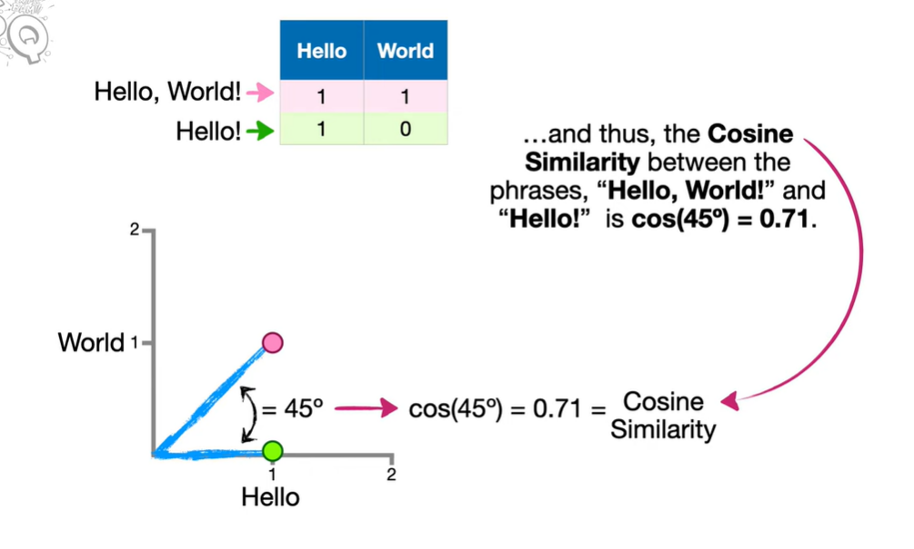
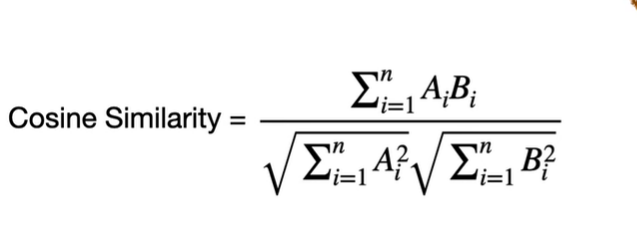

# FAQ NLP AI v0 - Documentation

## What This Project Does

Hey! So basically, I built this little FAQ chatbot that answers software engineering interview questions. It's pretty simple - you ask it something, and it tries to find the best matching answer from a dataset of pre-loaded questions.

The cool part? It uses **cosine similarity** (yeah, that formula from the images you shared!) to figure out how similar your question is to the ones it already knows about.

## How It Actually Works

### The Big Picture

When you ask a question:

1.  Your question gets converted into numbers (vectors) using TF-IDF
2.  The system compares your question to all stored questions using cosine similarity
3.  If there's a good match (similarity > 0.5), you get the answer
4.  If not, it gives you a friendly "I don't know" response and logs your question for later

### The Cosine Similarity Thing

Remember this image? That's exactly what's happening here. 



The Equation



Each question becomes a vector in multi-dimensional space, and we measure the angle between vectors. The smaller the angle, the more similar the questions are.

-   **Similarity = 1.0** → Questions are identical
-   **Similarity = 0.7** → Pretty similar (like "Hello, World!" vs "Hello!")
-   **Similarity < 0.5** → Not similar enough, probably different topics

## Project Structure

```
NLP_v0/
│
├── app/
│   ├── main.py               # FastAPI server
│   ├── faq_ai.py             # The brain of the operation
│   ├── data/
│   │   ├── faqs.csv               # used data
│   │   └── unanswered.txt         # logs of unanswered questions

```

## The Files Explained

### 1. `main.py` - The API Server

This is where i used FastAPI server. Think of it as the receptionist that handles incoming questions.

**What it does:**

-   Sets up a web server on the local machine
-   Has a `/health` endpoint to check if everything's running
-   Has a `/faq` endpoint where i send questions and get answers
-   Allows requests from any origin (CORS enabled) so i can use it from a web app (because i am still in test mode)

**Endpoints:**

```bash
# Check if server is alive
GET http://localhost:8000/health

# Ask a question
GET http://127.0.0.1:8000/faq?query=what%20is%20api

```

### 2. `faq_ai.py` - The Smart Part

This is where the magic happens. Let me break down what each part does:

#### `__init__` - Setting Things Up

```python
def __init__(self, faq_path):
```

When you create a new FaqAI object, it:

-   Loads the CSV file with all the FAQs
-   Cleans up column names (removes spaces, makes everything lowercase)
-   Creates a **TF-IDF vectorizer** (converts text to numbers)
-   Transforms all questions into vectors
-   Prepares some fallback messages for when it doesn't know something

**What's TF-IDF?** It stands for Term Frequency-Inverse Document Frequency. Basically, it figures out which words are important in each question. Common words like "the" or "is" get less weight, while specific words like "polymorphism" get more weight.

#### `get_answer` - The Main Function

```python
def get_answer(self, user_query, threshold=0.5):

```

This is the function that actually answers the questions:

1.  **Converts the question to a vector**
    
    ```python
    query_vec = self.vectorizer.transform([user_query])
    
    ```
    
2.  **Compares it to all stored questions**
    
    ```python
    similarities = cosine_similarity(query_vec, self.X)
    
    ```
    
    This gives a score between 0 and 1 (cos() result) for each stored question.
    
3.  **Finds the best match**
    
    ```python
    best_idx = similarities.argmax()
    best_score = similarities[0, best_idx]
    
    ```
    
4.  **Decides what to do**
    
    -   If score < 0.5: "Sorry, I don't know" + logs the question
    -   If score ≥ 0.5: Returns the answer with confidence level

## The Data File (`faqs.csv`)

The CSV looks like this:

```csv
Question Number,Question,Answer,Category,Difficulty
1,What is the difference between compilation and interpretation?,Compilation translates source code into machine code creating an executable file. Interpretation translates and executes code line by line without an executable.,General Programming,Medium
```

**Required columns:**

-   `Question` - The question text
-   `Answer` - The response

**Optional columns:**

-   `Category` - Topic category
-   `Difficulty` - Beginner/Intermediate/Advanced

## How to Use This Thing

### Installation

```bash
# Install dependencies
pip install fastapi uvicorn pandas scikit-learn

# Or if you have a requirements.txt
pip install -r requirements.txt

```

### Running the Server

```bash
# From the project root
uvicorn app.main:app --reload

# You should see:
# INFO:     Uvicorn running on http://127.0.0.1:8000

```

### Testing It Out

**Using your browser**

```
http://127.0.0.1:8000/faq?query=what%20is%20api

```

### Response Format

You'll get a JSON response like this: 

```json
{
  "answer": "RESTful API is a web service implementation using HTTP methods to perform CRUD operations on resources, adhering to stateless, client-server architecture.",
  "category": "Languages and Frameworks",
  "difficulty": "Medium",
  "confidence":0.676073543740708
}
```
Or if it doesn't know:

```json
{
  "answer": "I'm not sure about that. Try asking something related to software engineering.",
  "confidence": 0.32
}

```

## The Confidence Score

The confidence score tells you how sure the bot is about its answer:

-   **0.9 - 1.0** → Very confident, almost identical question
-   **0.7 - 0.9** → Pretty confident, very similar question
-   **0.5 - 0.7** → Moderately confident, somewhat related
-   **Below 0.5** → Not confident, probably wrong topic

## Handling Unknown Questions

When someone asks something the bot doesn't know, it:

1.  Picks a random fallback message
2.  Logs the question to `data/unanswered.txt`

This log file looks like:

```
How do microservices work?    0.3245
What is blockchain?            0.2891

```

i will review this file later and add these questions to the FAQ dataset!

## Limitations & Known Issues

**Current limitations:**

-   Only handles English questions
-   Doesn't understand context from previous questions
-   Can't learn new answers on the fly
-   Similarity is based purely on word matching (no semantic understanding)

**What it can't do:**

-   Answer questions not in the dataset
-   Have a conversation (each query is independent)
-   Understand slang or very informal language

## Final Thoughts

This is a v0 - a starting point. It's simple, but it works! The cosine similarity approach is actually pretty effective for FAQ systems when we have a well-defined set of questions.

The best part? we can see exactly how it makes decisions. No black box here - just some vectors and angles!

----------

_Built with ☕ and a lot of trial and error_